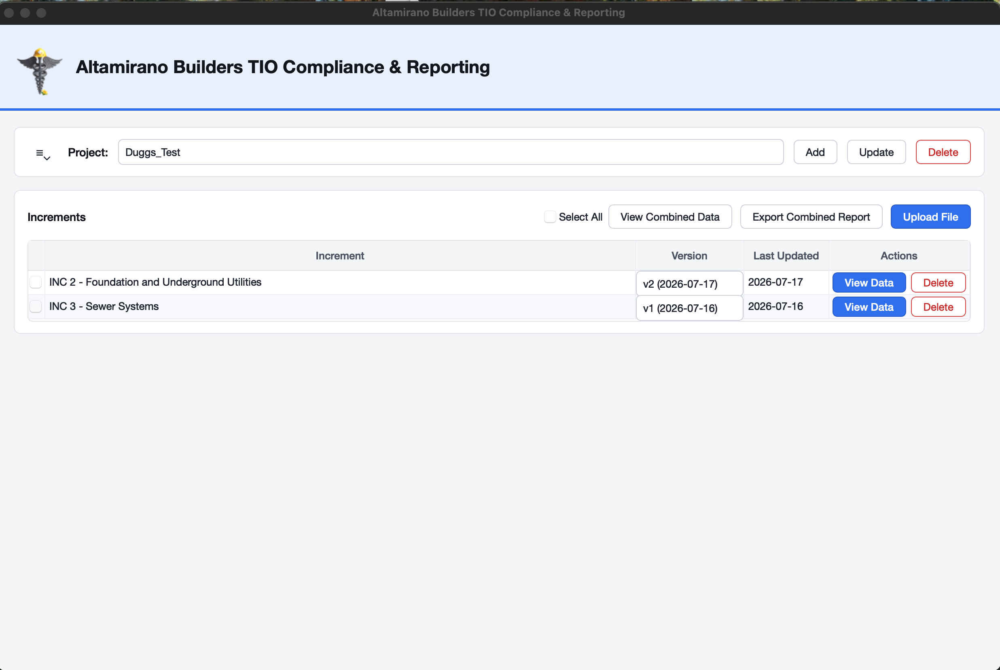
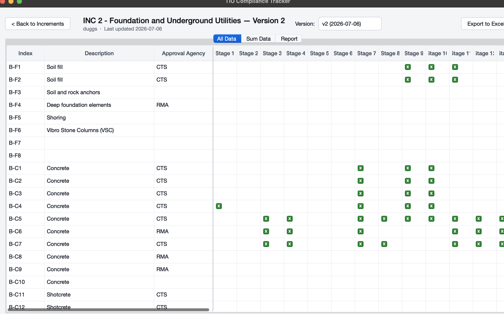
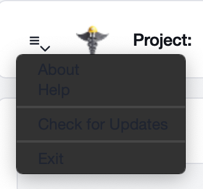
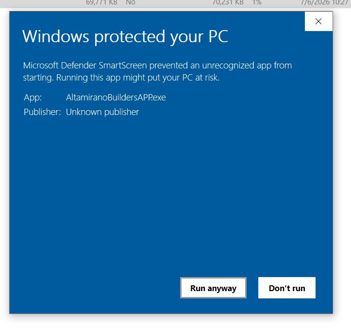

# Altamirano Builders TIO Compliance & Reporting

A desktop application that automates state compliance reporting for hospital construction inspection projects — replacing a fully manual, error-prone Excel workflow with an automated, auditable one.

## The Problem

California hospital construction projects go through HCAI's Testing, Inspection, and Observation (TIO) program. Every time the state sends an updated data file, the compliance team had to manually rebuild several linked Excel reports by hand — a slow, error-prone process where structural changes (new test items, renamed columns) or subtle value changes (a requirement count going from 0 to 2) could easily be missed.

This app reads the state's file, reconstructs the reports automatically, and — most importantly — tells you exactly what changed since the last version, before anything gets overwritten.

## What It Does

- **Reads the state's raw Excel file directly** — no manual data entry. The app reverse-engineers the state's own formulas and structure to normalize the data automatically.
- **Detects changes between file versions** — new items, removed items, changed values, and structural changes (renamed/missing columns) are all flagged separately, with a review screen shown before anything is saved.
- **Tracks completion status** per inspection item per stage, independent of what the state's file says, and preserves that progress across future file updates.
- **Generates four linked reports automatically**: a flat data view, a status/progress summary, a grouped agency report with totals, and a change history log — the same reports the team used to build by hand.
- **Combines multiple increments into one report**, with per-increment subtotals and one overall grand total.
- **Runs as a single Windows executable** — no installation, no dependencies, and the compliance team member can choose where their data is stored.

<!-- TODO: screenshot of the review/diff screen showing added/removed/changed items -->

## Key Features

| Feature | Description |
|---|---|
| Smart file matching | Uploading a file automatically detects whether it's a new increment or an update to an existing one, based on the record name inside the file itself |
| Change review | Every update shows exactly what's new, removed, or changed — before it's committed |
| Status tracking |  Per-stage Done/Open tracking, shown with clear color coding |
| Version history | Every uploaded version is kept; you can look back at any prior version at any time |
| Combined reporting | Select multiple increments and export one combined report with per-increment subtotals |
| Automatic updates | Built-in "Check for Updates" compares against the latest GitHub release |
| Safe deletion | Deleted projects and increments are recoverable, never immediately erased |

## Screenshots

App menu

Windows security prompt (expected on first run — unsigned software)

## Tech Stack

- **Python** with **PySide6 (Qt)** for the desktop UI
- **pandas** and **openpyxl** for Excel parsing, normalization, and report generation
- **PyInstaller** for packaging into a standalone Windows executable
- **GitHub Actions** for a fully automated, tag-triggered build and release pipeline (version-stamped, auto-published)
- Local JSON-based file storage — no database required, no external services

## Engineering Notes

A few things worth calling out for anyone reading the code:

- **The normalization logic was reverse-engineered from the state's own template**, not guessed — the mapping was derived from the actual Excel formulas in a real source file and validated cell-by-cell against known-correct output before anything was built on top of it.
- **Parsing is identity-based, not position-based** — items are matched by their own index/ID, not by row number, so the app doesn't break if the state adds, removes, or reorders rows in a future file.
- **17 test modules** cover the core normalization engine, diffing logic, storage layer, and export correctness — including regression tests for real bugs found during development (e.g. `pandas` silently converting blank cells to `NaN`, which then evaluated as truthy in a naive check).

## Download

The latest Windows build is available on the [Releases page](../../releases) — no installation required, just download and run.

## License

Copyright © 2026 Altamirano Builders. All rights reserved. See [LICENSE.txt](LICENSE.txt).
